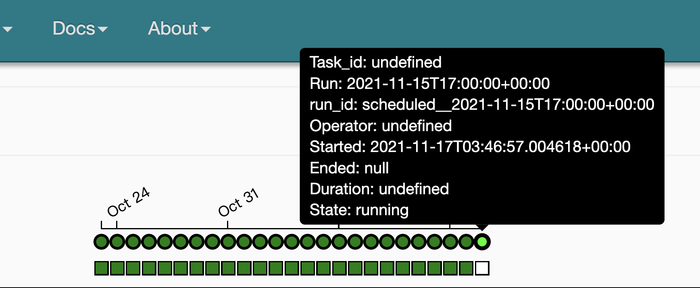

# 場景

某個 ETL Job 上線之後壞了，想要單獨重新啟動它，釐清壞掉的原因

[monitor (need permission)](https://p6dfcbe3c7bc93a21-tp.appspot.com/admin/airflow/gantt?dag_id=pixlake&root=)

1. 按下 `Clear` 而不是 `Run` - airflow 的邏輯是，`Clear` 表示清除該Task的狀態，那麼airflow會啟動工作流程去填滿該etl job 的狀態
2. **先 `Clear` Dataproc (pyspark cluster engine on GCP)，再啟動對應的 etl job (僅侷限在使用 Dataproc時)** --> 只要 Dataproc 一個
3. Upstream or Downstream 是否要清除，是你的任務而定
   1. 清除對應的 Upstream - 該 etl job 所有上游任務都 `Clear` a.k.a. 讓 airflow pipeline(from 上游etl to your etl ) 跑一遍
   2. 清出對應的 Downstream - 該 etl job 所有的下游任務都 `Clear` a.k.a. 讓 airflow pipeline (from your etl to 下游 etl) 跑一遍

# TimeStamp

</img>

Start : 2021-11-17 手動執行時間

Runtime : 2021-11-15 17:00 + 8 --> 2021-11-16  

airflow 基本上都要 +8 ， 因為 airflow 是 utc 時間