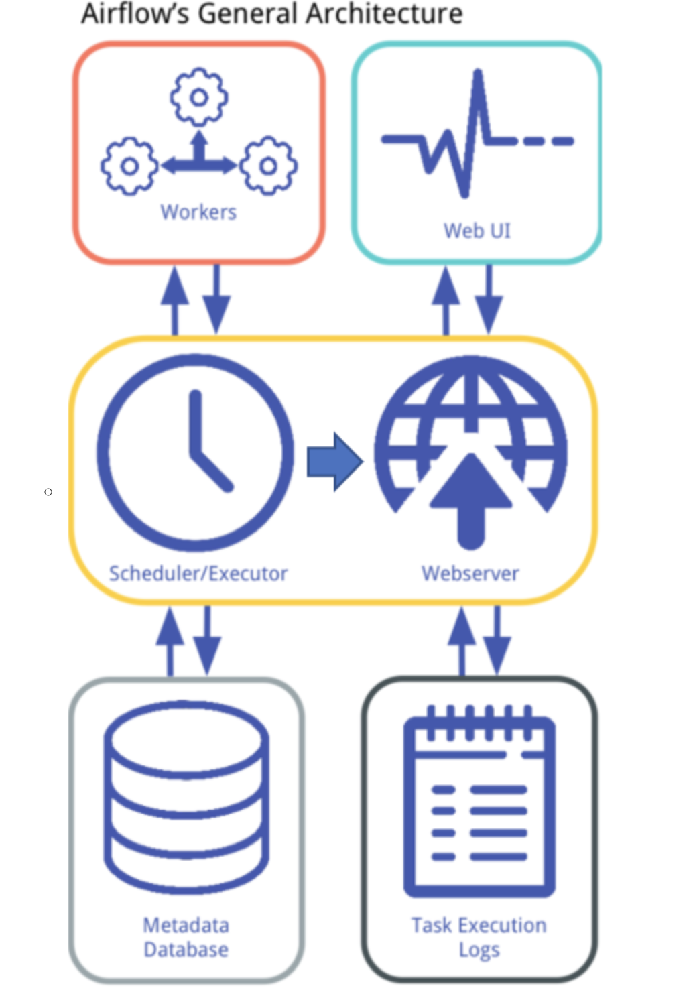

# Ref

https://hackmd.io/@JohnCena/Hki7kBTlP

# Airflow

</img>

1. workers : 負責執行 task
2. scheduler : 負責安排 task 給 workers，即時回報排成狀況給 webserver
3. webserver : 接收 scheduler 以及 task 的 log，並顯示在 UI 上
4. database : 上游 task 能將執行結果儲存到 database，下游能從 database 取得上結

# shceduler & webserver

1. 沒有開啟 scheduler 時， webserver 會每經過一段時間，從 `$AIRFLOW/dags` 底下查看 dags 的狀況，如果有更新或新增就會更新 WebUI 的 DAG，而開啟 scheduler 時，則會即時更新